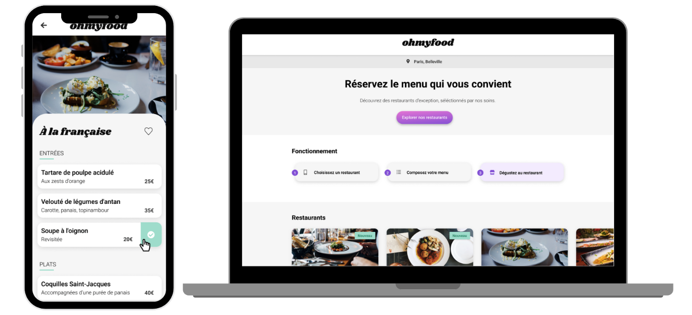

# Projet 4 : Ohmyfood

Ce projet Ohmyfood est un site web que j'ai développé dans le cadre de ma formation "développeur intégrateur web" d'openclassrooms permettant de gérer des commandes de différents menus (Entrée, plats et desserts) sur différents restaurants de la chaîne. 
J'avais pour objectif d'implémenter entièrement le code à partir des maquettes fournies par les équipes d'openclassrooms.
Le développement devait se faire en Mobile First et contenir les différentes animations attendues.

## Technologies utilisées

- Front-end : HTLM5, CSS3
- SASS avec utilisation de la convention BEM
- Git et GitHub
- Visual Studio Code

## Compétences clés 

- Intégrer une maquette en mobile-first.
- Mettre en oeuvre des animations CSS : transitions et animations avec utilisation des keyframes.
- Intégration de variables et de mixins avec l'utilisation du préprocesseur CSS "SASS". 
- Versionner son projet avec Git et GitHub.

## Fonctionnalités 

- Sélectionner un des 4 restaurants proposés.
- Sélectionner un menu, une entrée, un plat et un dessert au choix.
- Commander sa sélection.
- Liker un ou des restaurants et un ou des menus en fonction des préférences.

## Installation et lancement

1. Téléchargher le dépôt :

git clone https://github.com/Thierry77170/Ohmyfood.git

2. Choisissez parmis les 3 possibilités :

- Ouvrir dans VS Code avec l'extension "Go live".
- Ouvrir le fichier HTML directement dans le dossier.
- Aller directement dans la version live : https://github.com/Thierry77170/Ohmyfood

